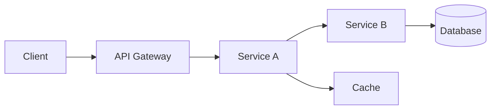
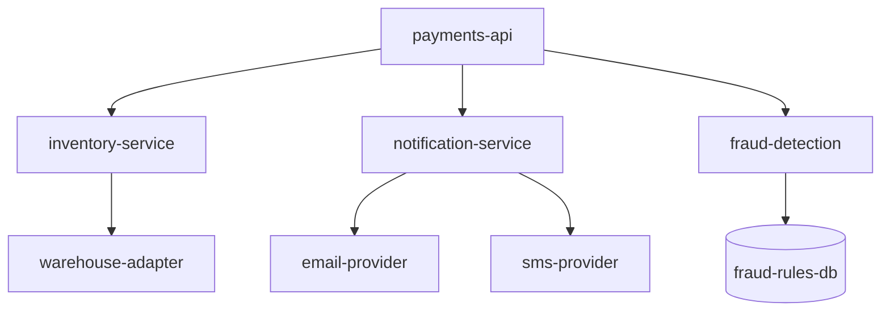
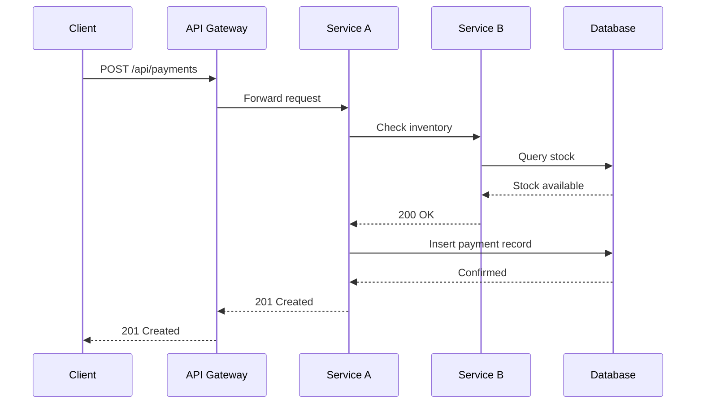
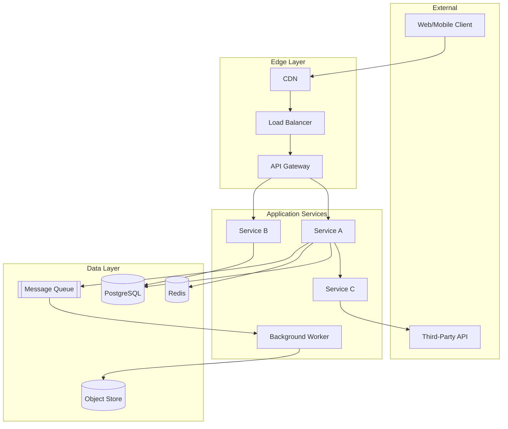
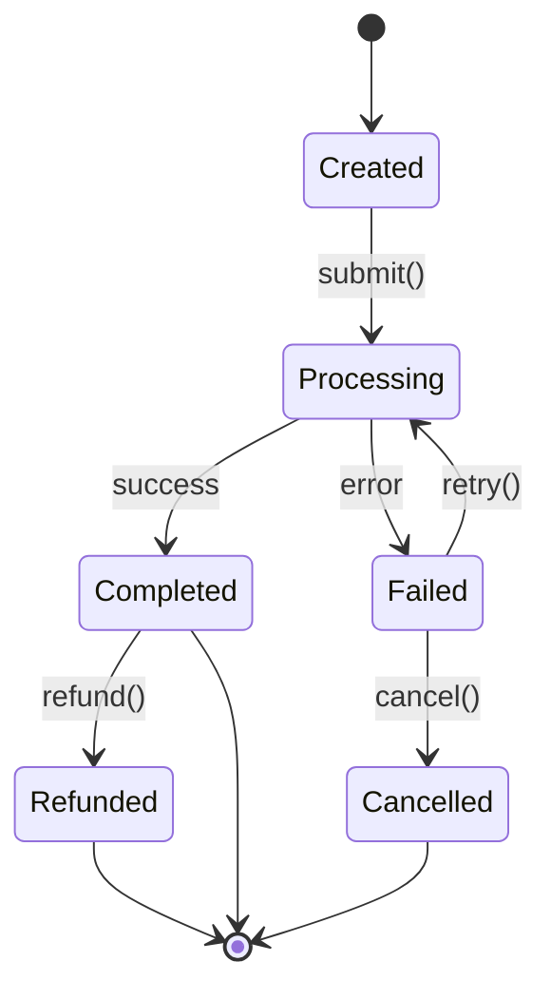
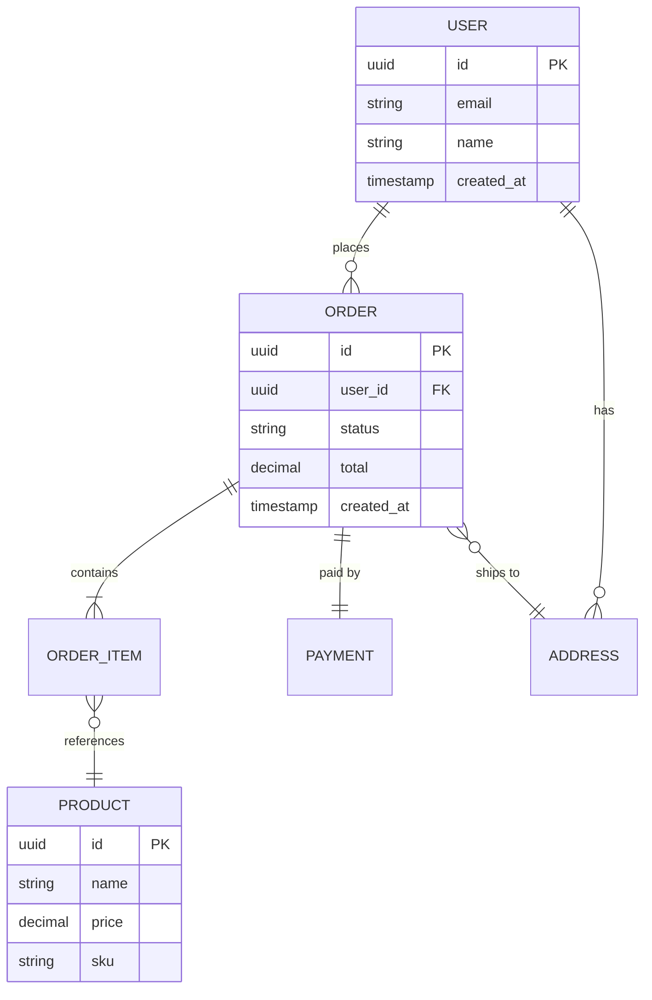

# Diagram Templates

Use these Mermaid templates when generating architecture diagrams. Pick the
diagram type that best fits the concept you are illustrating.

---

## 1. Call Chain (Horizontal Flow)

Use for showing a single request path through multiple services.

**When to use:** Answering "what happens when a user does X?" — trace the
request from entry point to data store.

**Tips:**
- Keep it linear — one primary path per diagram
- Use `[(Database)]` for data stores, `[Cache]` for caches
- Add labels on edges for protocol: `-->|gRPC|`, `-->|REST|`, `-->|async|`

---

## 2. Dependency Graph (Vertical / Top-Down)

Use for showing which services depend on which.

**When to use:** Mapping a service's upstream and downstream dependencies,
answering "what does this service talk to?"

**Tips:**
- Put the service under investigation at the top
- Group related dependencies visually
- Use different edge styles for sync vs async:
  `-->` for synchronous, `-.->` for asynchronous / event-driven

---

## 3. Sequence Diagram

Use for showing time-ordered interactions between components.

**When to use:** Investigating timing-sensitive issues, debugging request
flows, or explaining multi-step processes.

**Tips:**
- Use `-->>` (dashed) for responses, `->>` (solid) for requests
- Add `Note over A,B: description` for annotations
- Use `alt` / `else` blocks for branching logic
- Keep to ≤8 participants to stay readable

---

## 4. System Architecture (with Subgraphs)

Use for showing the overall system with logical groupings.

**When to use:** Architecture overview pages, onboarding docs, or answering
"how is the system structured?"

**Tips:**
- Group components into logical subgraphs (edge, services, data)
- Use descriptive subgraph labels
- Limit to 12–15 nodes maximum — split into multiple diagrams if larger

---

## 5. State Diagram

Use for showing entity lifecycle or workflow states.

**When to use:** Explaining entity state machines (order lifecycle, payment
states, deployment stages), or answering "what are the possible states of X?"

**Tips:**
- Label transitions with the action or event that triggers them
- Include terminal states (`[*]`)
- Show error/retry paths — these are often the most important for debugging

---

## 6. Entity Relationship Diagram

Use for showing data model relationships.

**When to use:** Documenting database schemas, explaining data models, or
answering "how is data structured?"

**Tips:**
- Show cardinality (`||--o{` = one-to-many, `||--||` = one-to-one)
- Include key columns (PK, FK) but skip low-importance fields
- Group related entities visually

---

## Choosing the Right Diagram

| Question Type | Diagram |
|--------------|---------|
| "What happens when…?" | Call Chain or Sequence |
| "What does this service depend on?" | Dependency Graph |
| "How is the system structured?" | System Architecture |
| "What are the possible states of…?" | State Diagram |
| "What is the data model?" | ER Diagram |
| "How do these services interact over time?" | Sequence Diagram |
